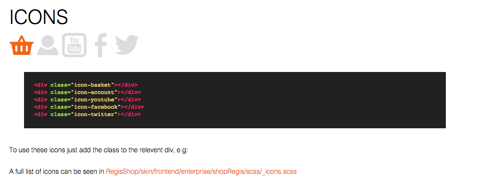
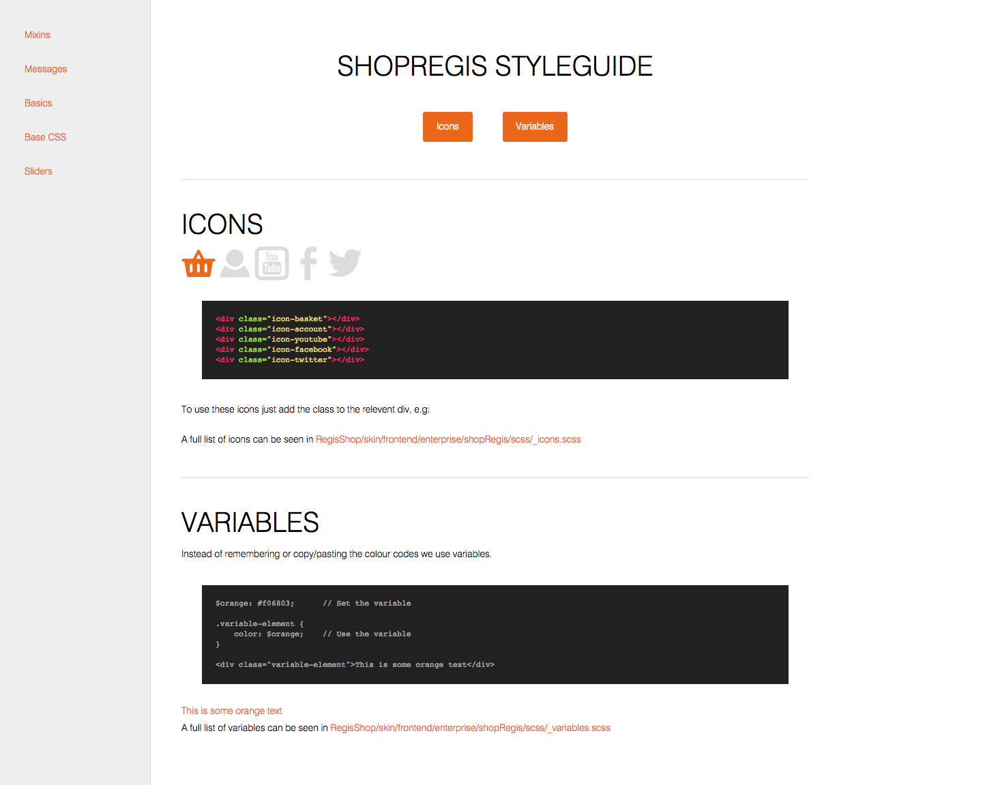

# Styleguide generator

Like a wiki, but for a project's code/styles :)

[Example here](http://bencrook.co.uk/hologram)

**The stylesheets directory should be placed in the theme directory. E.g skin/frontend/enterprise/THEMENAME/styleguide**

With some of our projects being so large it can be near impossible to keep track of how everything should be done such as which mixins to use, carousels, icons, font-sizes, buttons, breakpoints, mixins, some sites use rems, some use px, some don't even have mixins and the list goes on. Instead of rooting through the scss files to find out you can simply just look at the styleguide.

This is a styleguide/code guide generator using Hologram, all we need to do is add a few comments in the SCSS files and it will automatically generate a styleguide for us. This will enable us to look at the styleguide and see how a certain feature should be implemented, this can save duplicated features and several different methods for one fix. If you haven't worked on a certain feature/project you need to familiarise yourself with it, this can majorly help with that.

I looked into styleguides after finding one site with around 6 different modal frameworks implemented instead of just 1 as standard, having a styleguide/code guide could have prevented this.

## Requirements

The only thing you require is hologram, which can be installed with `gem install hologram` (you may need to run with sudo)

## How to add styles/code

It works by adding comments in the SCSS file (takes like 2 minutes), Hologram will do the rest. As we should be adding comments anyway this is a win win, we get comments and a styleguide. The comments in the scss file should look like so (I've added a few comments just to help explain, these aren't in the styleguide themself):

```
/*doc
---
title: Icons       // What you want to display in the h1 tag
name: Icons        // The name of the section you're documenting
category: Basics   // The category/page it is relevent to
---

// Remove the spaces from the backticks below

` ` `html_example    // Adding html_example here tells Hologram to render the HTML on the page, without this it will just display the code (you can still enter the HTML manually underneath to display it)

<div class="icon-basket"></div>
<div class="icon-account"></div>
<div class="icon-youtube"></div>
<div class="icon-facebook"></div>
<div class="icon-twitter"></div>
` ` `
To use these icons just add the class to the relevent div, e.g:

A full list of icons can be seen in <span class="orange">skin/frontend/enterprise/shopRegis/scss/_icons.scss</span>
*/
```

(I had to split the code into 2 parts to display it properly on GitHub)

This will show the following:



To generate the styleguide just run `hologram` in the terminal/Cmd line (from the same directory as hologram_config.yml)


## Example

To see a small example [click here](http://bencrook.co.uk/hologram) or download this repo to the projects theme folder and view styleguide > docs > index.html in your browser. The links on the left are different categories/pages, with links to the subsections at the top where relevent.




## Configuration

There is hardly any configuration required, the directories are specified in hologram_config.yml and the css links are added in _header.html, that's it.


